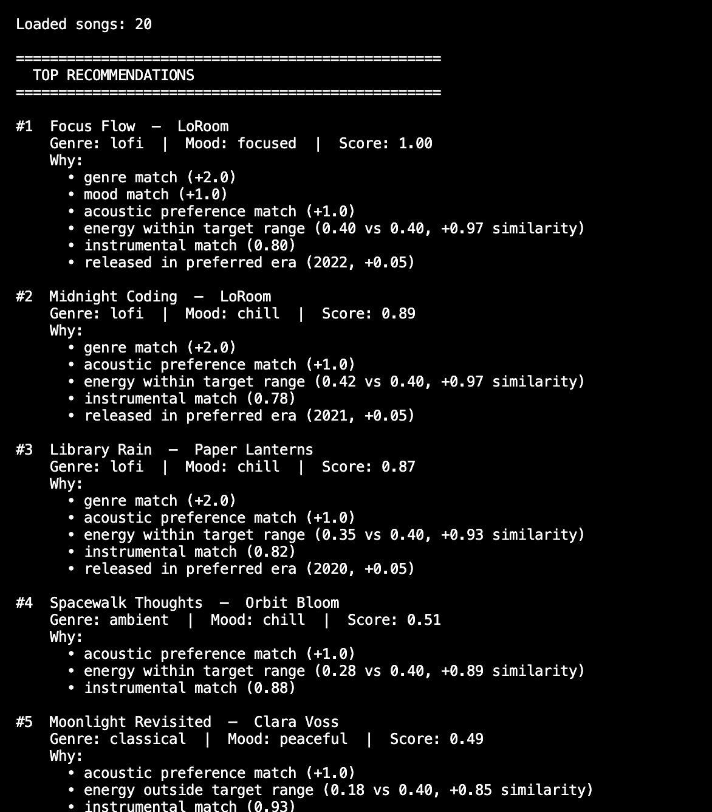
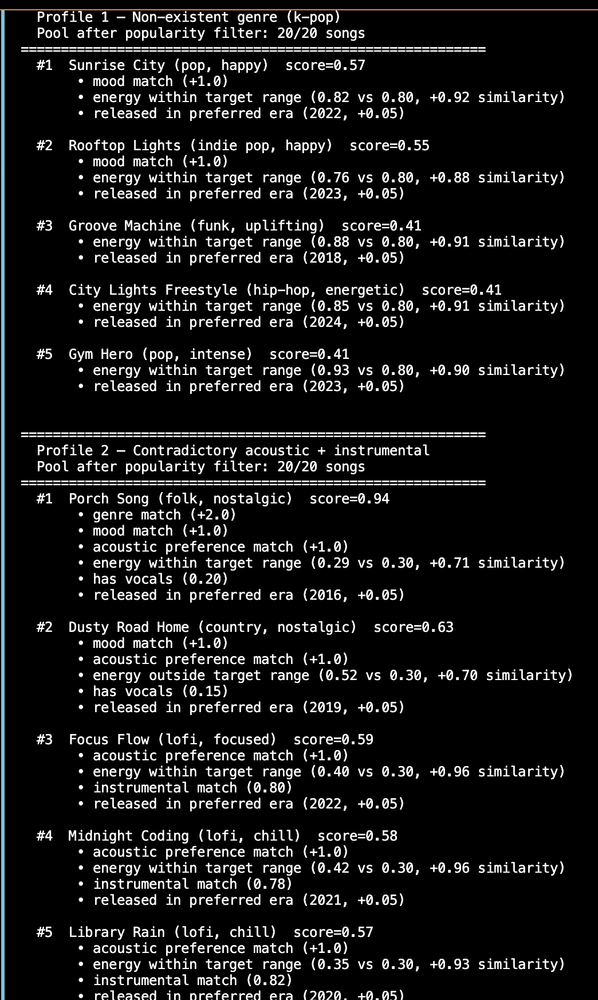
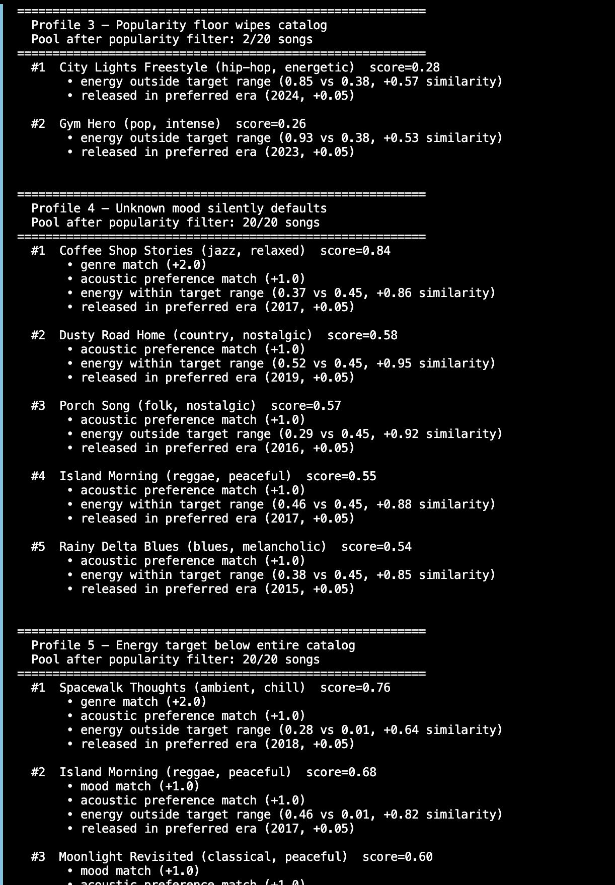
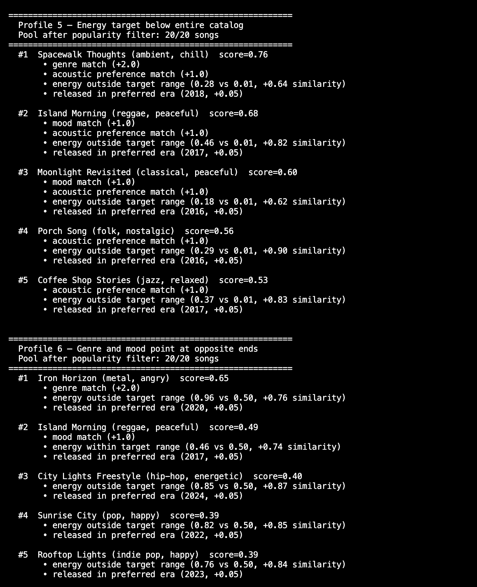

# 🎵 Music Recommender Simulation

## Project Summary

In this project you will build and explain a small music recommender system.

Your goal is to:

- Represent songs and a user "taste profile" as data
- Design a scoring rule that turns that data into recommendations
- Evaluate what your system gets right and wrong
- Reflect on how this mirrors real world AI recommenders

Replace this paragraph with your own summary of what your version does.

---

## How The System Works

Explain your design in plain language.

Some prompts to answer:

- What features does each `Song` use in your system
  - For example: genre, mood, energy, tempo
- What information does your `UserProfile` store
- How does your `Recommender` compute a score for each song
- How do you choose which songs to recommend

You can include a simple diagram or bullet list if helpful.

Each Song stores ten attributes: an id, title, and artist for identification, plus seven scoring features — genre and mood (categorical), and energy, tempo_bpm, valence, danceability, and acousticness (numeric floats between 0 and 1). A UserProfile captures four preferences: favorite_genre, favorite_mood, target_energy, and likes_acoustic. To score a song, the Recommender runs two layers: a rule layer that awards points for categorical matches (genre +1.5, mood +1.5, acoustic preference +1.0, normalized to [0, 1]), and a similarity layer that measures Euclidean distance across energy, acousticness, and valence — converting proximity into a [0, 1] score. These combine as 0.6 × rule score + 0.4 × similarity score. To choose recommendations, every song in the catalog receives a hybrid score, the list is sorted highest to lowest, and the top k results are returned — each paired with a plain-language explanation of what drove the match.

## Song features: ##

Feature	Type	Role in scoring
genre	categorical	rule layer — +1.5 if matches user
mood	categorical	rule layer — +1.5 if matches user
energy	float [0,1]	similarity layer — distance from target_energy
acousticness	float [0,1]	similarity layer — distance from inferred target
valence	float [0,1]	similarity layer — distance from mood-inferred target
tempo_bpm	float	stored, not used in scoring
danceability	float [0,1]	stored, not used in scoring
id, title, artist	metadata	display only
UserProfile fields:

Field	Type	How it's used
favorite_genre	string	matched against song.genre in rule layer
favorite_mood	string	matched against song.mood; also maps to a valence target
target_energy	float [0,1]	compared to song.energy in similarity layer
likes_acoustic	bool	maps to acousticness target (0.75 if True, 0.15 if False)

## How The System Works ##

The recommender scores every song in the catalog against a user profile using a hybrid of two layers. The rule layer (weighted at 60%) awards points for categorical matches — +2.0 for a genre match, +1.0 for a mood match, and +1.0 if the user prefers acoustic and the song's acousticness exceeds 0.6 — then normalizes the total to a [0, 1] score. The similarity layer (40%) computes Euclidean distance across four numeric features — energy, acousticness, valence, and instrumentalness — converting proximity into a second [0, 1] score, with a tolerance band on energy so small deviations don't penalize a song. The two layers combine into a single hybrid score, with a small recency bonus for songs from the user's preferred era. Songs below a popularity floor are filtered out before scoring, and the top-k results are returned each with a plain-language explanation of what drove the match.

## Limitations and Risks ##

The system has several built-in limitations worth naming. Because genre carries twice the weight of mood, a great song that matches the user's listening context but belongs to a different genre will consistently rank below a genre match with the wrong mood — which is the wrong trade-off for activity-based listeners like someone studying or working out. The 20-song catalog is too small for the similarity layer to matter much: when only one or two songs match a genre, the rule layer dominates and the numeric features rarely change the ranking. The popularity floor silently removes songs before scoring, so a niche track that would have been a perfect match simply never appears. Finally, the profile is static — it never updates based on what the user actually plays or skips, which means it can only reflect what the user thought they wanted, not what they actually respond to.





---

## Getting Started

### Setup

1. Create a virtual environment (optional but recommended):

   ```bash
   python -m venv .venv
   source .venv/bin/activate      # Mac or Linux
   .venv\Scripts\activate         # Windows

2. Install dependencies

```bash
pip install -r requirements.txt
```

3. Run the app:

```bash
python -m src.main
```

### Running Tests

Run the starter tests with:

```bash
pytest
```

You can add more tests in `tests/test_recommender.py`.

---

## Experiments You Tried

Use this section to document the experiments you ran. For example:

- What happened when you changed the weight on genre from 2.0 to 0.5
- What happened when you added tempo or valence to the score
- How did your system behave for different types of users

---

## Limitations and Risks

Summarize some limitations of your recommender.

Examples:

- It only works on a tiny catalog
- It does not understand lyrics or language
- It might over favor one genre or mood

You will go deeper on this in your model card.

---

## Reflection

Read and complete `model_card.md`:

[**Model Card**](model_card.md)

Write 1 to 2 paragraphs here about what you learned:

- about how recommenders turn data into predictions
- about where bias or unfairness could show up in systems like this


---

## 7. `model_card_template.md`

Combines reflection and model card framing from the Module 3 guidance. :contentReference[oaicite:2]{index=2}  

```markdown
# 🎧 Model Card - Music Recommender Simulation

## 1. Model Name

Give your recommender a name, for example:

> VibeFinder 1.0

---

## 2. Intended Use

- What is this system trying to do
- Who is it for

Example:

> This model suggests 3 to 5 songs from a small catalog based on a user's preferred genre, mood, and energy level. It is for classroom exploration only, not for real users.

---

## 3. How It Works (Short Explanation)

Describe your scoring logic in plain language.

- What features of each song does it consider
- What information about the user does it use
- How does it turn those into a number

Try to avoid code in this section, treat it like an explanation to a non programmer.

---

## 4. Data

Describe your dataset.

- How many songs are in `data/songs.csv`
- Did you add or remove any songs
- What kinds of genres or moods are represented
- Whose taste does this data mostly reflect

---

## 5. Strengths

Where does your recommender work well

You can think about:
- Situations where the top results "felt right"
- Particular user profiles it served well
- Simplicity or transparency benefits

---

## 6. Limitations and Bias

Where does your recommender struggle

Some prompts:
- Does it ignore some genres or moods
- Does it treat all users as if they have the same taste shape
- Is it biased toward high energy or one genre by default
- How could this be unfair if used in a real product

---

## 7. Evaluation

How did you check your system

Examples:
- You tried multiple user profiles and wrote down whether the results matched your expectations
- You compared your simulation to what a real app like Spotify or YouTube tends to recommend
- You wrote tests for your scoring logic

You do not need a numeric metric, but if you used one, explain what it measures.

---

## 8. Future Work

If you had more time, how would you improve this recommender

Examples:

- Add support for multiple users and "group vibe" recommendations
- Balance diversity of songs instead of always picking the closest match
- Use more features, like tempo ranges or lyric themes

---

## 9. Personal Reflection

A few sentences about what you learned:

- What surprised you about how your system behaved
- How did building this change how you think about real music recommenders
- Where do you think human judgment still matters, even if the model seems "smart"

